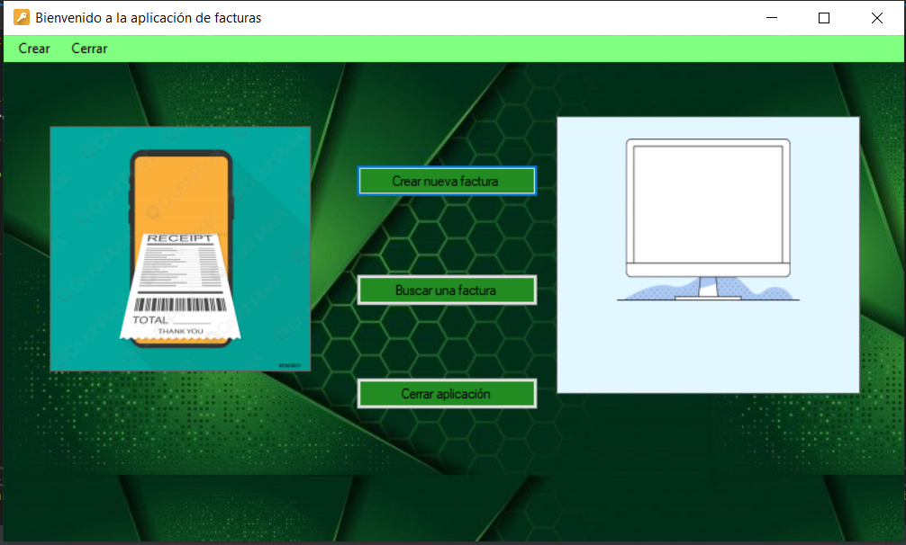

# Interfaces gráficas

Los proyectos de C# han ido centrados en creación de interfaces gráficas para aplicaciones de escritorio.

## CrearFacturas
Este proyecto busca crear una aplicación sencilla que genere facturas de compra y las visualice. Existen las opciones de buscar otras facturas creadas anteriormente en tiempo de ejecución. La ventana de creación permite rellenar los datos de la factura y crearla.

Para ejecutar el programa sólo es necesario abrir el archivo ```aplicacionFacturas.exe``` situado en ```aplicacionFacturas/aplicacionFacturas/bin/Debug```

### Evidencias



## Calculadora
Con este pequeño proyecto se pretende recrear el funcionamiento de un calculadora básica.

Para ejecutar el programa sólo es necesario abrir el archivo ```Calculadora.exe``` situado en ```Calculadora/Calculadora/bin/Debug```
