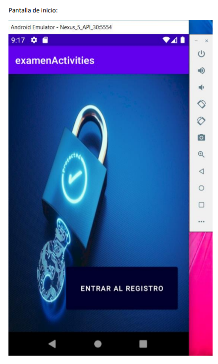
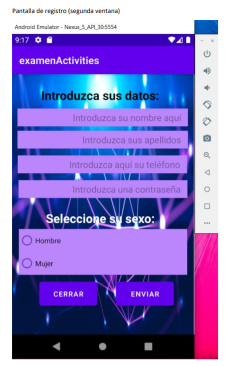
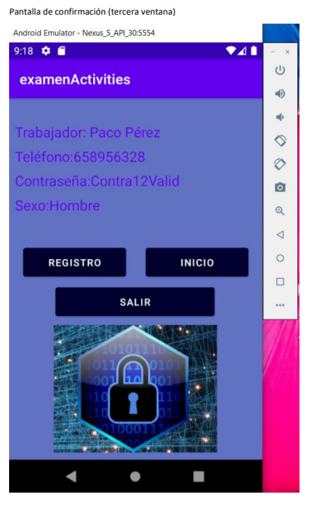

# Proyectos en Java

En este repositorio se almacenan algunos de los proyectos desarrollados en lenguaje Java, sean aplicaciones de consola, interfaces gráficas o aplicaciones móviles creadas con la librería Android.


## Editor de texto
Este proyecto replica un editor de texto sencillo. El objetivo principal era crear una interfaz gráfica utilizando Java swing y otorgar funcionalidades a los botones y opciones de menú a través de eventos.

Para ejecutar el programa sólo es necesario abrir el ```editor.jar``` situado en el repositorio, para ello es necesario tener instalada la máquina virtual de Java


## POO (Programación Orientada a Objetos)
Este proyecto busca aplicar los conocimientos adquiridos sobre POO y herencia, creando un programa por consola con distintas clases relacionadas entre sí.
Para poder ejecutarlo es necesario un entorno como Eclipse/IntelliJ/NetBeans donde podamos crear un paquete llamado ```Portfolio``` y situar allí los archivos .java. En la clase Ejecutar (```Ejecutar.java```) se encuentra el método main que permite lanzar la ejecución del programa.


## AndroidStudio
Este es un proyecto sencillo en el que se empieza a utilizar la librería de Android para el desarrollo móvil. 
En este ejercicio se enlazan varias ventanas y se pretende registrar información de empleados, mostrando, a continuación del registro, la información almacenada.

Para poder probar la aplicación puede instalar el archivo ```registro.apk``` en su dispositivo móvil y ejecutarlo.

### Evidencias





