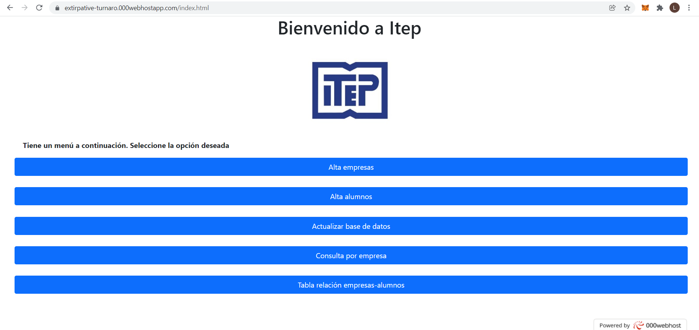
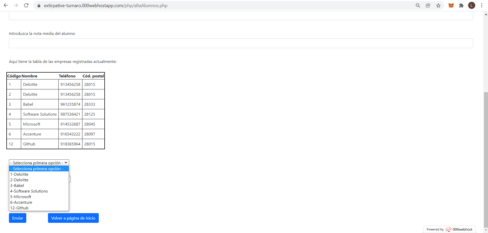

# Proyectos web

En este apartado se sitúan proyectos con una interfaz gráfica basada en html y css y con funcionalidades en php y/o javascript

## Proyecto de prácticas
Este proyecto se centra en la creación de una aplicación destinada a un docente encargado de asignar las prácticas de formación profesional para facilitar su trabajo.
Actualmente, tiene incluidas las funciones de dar de alta (sea una empresa o un alumno), de asignar las plazas de prácticas por orden de nota de los alumnos y mostrar una tabla de asignación.
Es un proyecto con fines educativos y por ello el acceso a la base de datos está incorporado directamente (no solicita un login)

Para poder probar las distintas funcionalidades se facilita un enlace de un hosting donde está alojada actualmente la página y la base de datos:
https://extirpative-turnaro.000webhostapp.com/index.html

### Evidencias

